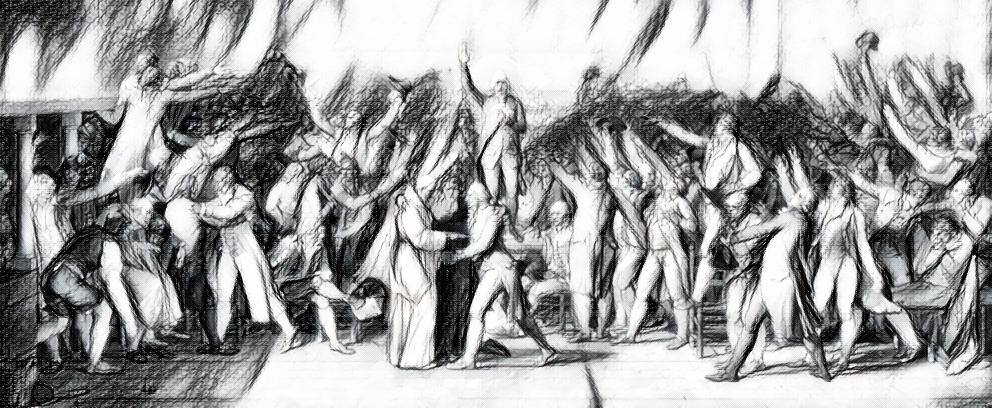

# Welcome to [Git][Politics]

## [Intro]

Imagine politics were as transparent as GitHub changes, so you could trust in government.

[Git][Politics] is currently a German project aiming to 

1. **visualize politician's work world wide**,
2. visualize politics (**political processes**),
3. **clarify policies**
4. and make the entire political system comprehensible 

available for everyone. 

On this roadmap the aim is to develop a powerful tool to track all the changes on an easy to use interface. 

Secondly, is it possible to create machine executable law? We recently develop this ideas and want to integrate this in the [Git][Politics] process. Share your opinion in comments and issues.

## [Git] 

[Git](https://github.com/git/git) is a version control system and familiar tool in the programming world. It was created and developed by Linus Towards (also the initial mastermind of Linux). It is primarly used for source code management, but can help to store any source of files versionizable. Git can be used on a variety on different servers. Mostly known are [GitHub](https://github.com), [Bitbucket](https://bitbucket.com), and [GitLab](https://gitlab.com). But also other servers can be used or created on private servers.

Graphical people may want to understand the Git picture in an infographic. A very good one is the following . It is simple and easy to understand - thanks to rogerdudler.

For all of you, who are not familiar with GitHub. Here is a little introduction page about [features of Github](https://github.com/features). They are very generic and appliable for several domains not only coding, but also politics. 

The [git cheat sheet from tower](https://www.git-tower.com/blog/git-cheat-sheet) or the official [GitHub cheat sheet](https://github.github.com/training-kit/) are a useful tool to get an overview of general the functions of git. Later on, we will provide a political definition of those functions and a domain applied git version for politics. For sure this will include a cheat sheet for '''gitpol'''

## [Git GUI]

Mainly programmers use Git in command-line interfaces - CLI for short (those black blinking lines of code in the movies) which are useful because there are simple and fast. However, for not so geeky people who would like to collaborate using graphical user interfaces (GUI) with buttons and a proper visualization there are several options. 

A list of existing GUI is available on the [official git page](https://git-scm.com/downloads/guis).

## [Politics]

Politics is about the political process to procede in law making of legislational power. Therefore, ussually poltical topics are subdivided into themes. An adaptable, iterable process is common practice. 

'IMAGE POLITICAL PROCESS'

## [OtherStuff]

On GitHub there are also other repositories created around the recently developing topic [politics](https://github.com/topics/politics). Take a look and feel free to add other ideas. Share your opinion to create a more transparent way to do politics. 

This idea is not unique. Other people have the very same concept in mind. On Medium Michał Nerć texts in his article [Git as a tool to ultimate democracy](https://medium.com/@derodu/git-as-a-tool-to-ultimate-democracy-26c0af319dce) his perspective how 'git' can change the democratic process and provide transperancy for everyone. 

## [Team]

We are a small team of open-minded political and informatics interested people. 
If you are interested how coding and formalization can change politics, you are welcome to join the community.

## Yet to be done

- creating a applied fork of git for gitpol
- creating an applied cheat sheet for gitpol
- 

[Edit on GitHub](https://github.com/sebastianwindeck/GitPolitics/master/docs/README.md) to maintain and preview the content for your website in Markdown files.

